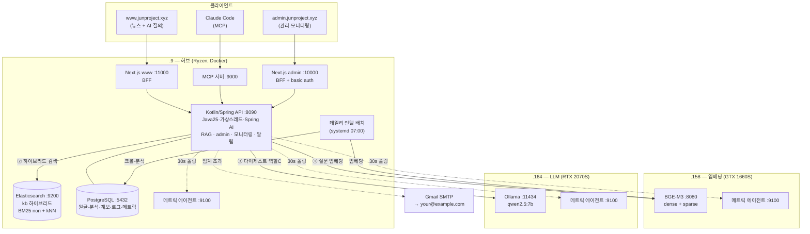

# local-llm — 개발 지식 RAG + 데일리 인텔 시스템

3대의 GPU/서버와 Claude를 엮어 만든 **개발 지식 검색(RAG) + 매일 자동 갱신되는 기술 인텔리전스** 시스템이다.
"좋은 설계·코드 판단"에 필요한 지식(설계 원칙·언어/기술 변천사·코드 레퍼런스·기술 계보)과 매일의 개발 뉴스를
하나의 하이브리드 벡터 인덱스에 쌓아두고, **약한 로컬 LLM이 1차로 검색·정제(역할 C)하고 Claude가 최종 합성**한다.

핵심 통찰: 맨몸의 7B 모델은 "낙관적 락"을 "긍정적인 태도"로 오답하지만, 검색된 설계 문서를 컨텍스트로 주입하면
정확한 동시성 제어 설명을 낸다. **약한 모델 + 좋은 검색 = grounded 정답.**

---

## 아키텍처



**질의 흐름**: 질문 → Spring API → ①BGE-M3로 임베딩 → ②ES 하이브리드 검색(BM25 한국어 + 벡터, 수동 RRF) →
③Ollama가 검색 청크를 읽고 한국어로 정제(역할 C) → grounded 답변 + 출처. Claude는 이 API를 호출해 최종 합성한다.

---

## 프로젝트 구조

```
local-llm/
├── corpus/                 설계 원칙 레퍼런스 44개 (backend/frontend/infra) — 깃 관리 제외(데이터)
├── graph/                  변천사 계보 추출 JSON — 깃 관리 제외(임베딩 내용)
├── servers/                서버별 배포 단위
│   ├── core/               .9  ES(+nori) + PostgreSQL — 저장층
│   ├── embedding/          .158 BGE-M3 FastAPI — dense+sparse 임베딩
│   ├── llm/                .164 Ollama(qwen2.5:7b) — 다이제스트 LLM
│   ├── indexer/            정적 KB 적재: ingest(섹션청킹) · load_graph(계보) · tech_ingest(코드주석)
│   ├── intel/              데일리 인텔: crawl(5소스) · analyze(분석+임베딩) · systemd 타이머
│   ├── api/                Kotlin/Spring 백엔드 (RAG·admin·모니터링·알림) — 시스템의 두뇌
│   ├── metrics-agent/      각 호스트 자원 수집 에이전트(:9100)
│   ├── web/                Next.js www (공개 — 뉴스 + Q&A)
│   ├── admin/              Next.js admin (관리 — 검증·모니터링)
│   └── mcp/                MCP 서버 (코딩 에이전트용 지식 질의)
└── docs/plans/.../         설계(master-plan)·빌드로그·OVERVIEW — 깃 관리 제외(로컬)
```

### 각 구성요소의 역할
- **core (.9)** — Elasticsearch가 모든 지식의 하이브리드 검색을, PostgreSQL이 원글·분석문·계보 그래프·사용량/메트릭 로그를 보관한다.
- **embedding (.158)** — BGE-M3로 텍스트를 dense(1024)+sparse 벡터로 바꾼다. RAG에서 ML이 필요한 유일한 지점이라 Python 유지.
- **llm (.164)** — Ollama가 qwen2.5 7B를 GPU로 서빙. 검색된 청크를 읽고 질문에 맞춰 정제(역할 C)한다.
- **api (Kotlin/Spring)** — 시스템의 두뇌. 검색 오케스트레이션 + 공개 read API + admin(데이터 CRUD·검증·사용량 로깅·3호스트 자원 모니터링·임계 알림). Java 25 가상스레드 위에서 블로킹 호출, 채팅은 Spring AI로 Ollama를 래핑.
- **intel** — 매일 07:00 systemd 타이머가 뉴스/트렌딩 repo를 수집(dedup) → 분석 → 임베딩해 누적.
- **metrics-agent** — 호스트마다 떠서 CPU·메모리·디스크·네트워크·GPU·Docker를 JSON으로 제공, Spring이 폴링한다.
- **web / admin / mcp** — 소비 3채널. www는 공개 뷰+질의, admin은 인증 후 관리, MCP는 코딩 중 지식 질의.

---

## 지식베이스 (ES `kb`, namespace 분리)

| namespace | 내용 | 성격 |
|-----------|------|------|
| `corpus` | 설계 원칙 44 (동시성·정합성·렌더링·인프라…) | 불변 |
| `history` | 7개 언어/기술 변천사 (java·db·python·rust·js·web·network) | 누적 |
| `tech` | study-practice 코드 레퍼런스 983 (헤더 주석) | 정적 |
| `qa` | 개발 단계별 질문 가이드 | 정적 |
| `intel` | 데일리 기술 뉴스·repo 분석 | 시의성·갱신 |
| `graph` | 기술 계보 노드(파생·반작용·영향) | GraphRAG |

`graph`는 변천사에서 추출한 노드 253·엣지 357을 PG에 두고 노드 요약을 임베딩 — "무엇에서 왜 파생됐나"를 답한다.

---

## 데이터 흐름 요약

- **질의**: 클라이언트 → BFF/MCP → Spring → (임베딩 → 검색 → 다이제스트) → 답변+출처
- **데일리 인텔**: 크롤 → dedup → 분석 → 임베딩 → www·Q&A에 자동 반영
- **모니터링**: 에이전트(3호스트) → Spring 30초 폴링 → PG 저장 → 임계 초과 시 Gmail → Naver 알림 → admin 대시보드 실시간 표시
- **데이터 검증**: admin에서 분석문 수정 시 PG 갱신 + ES 재임베딩으로 검색 일관성 유지
